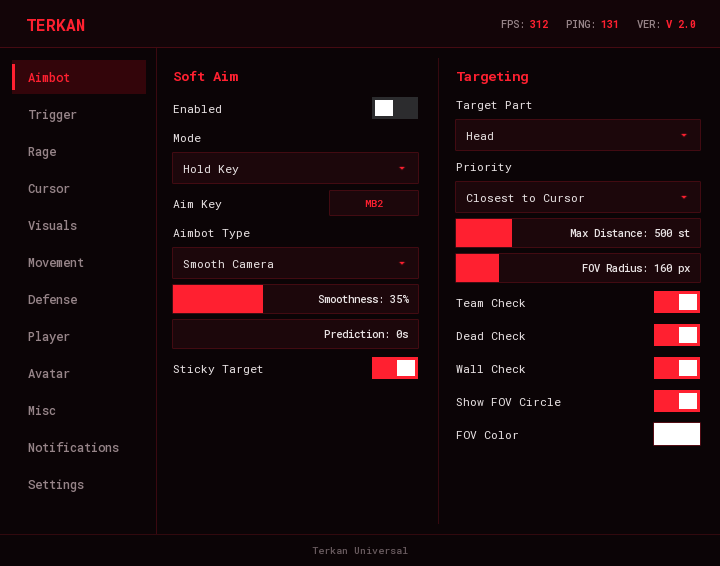
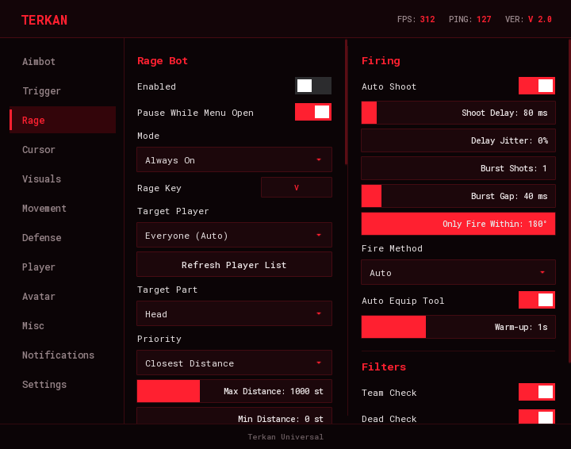
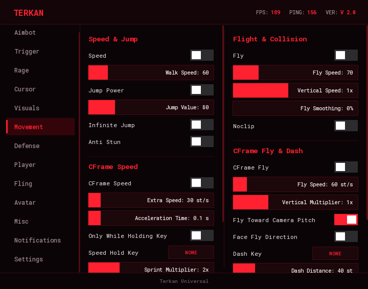
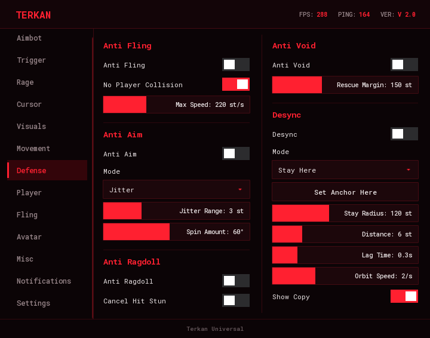
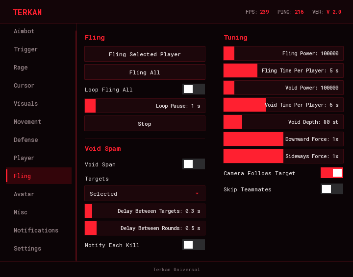
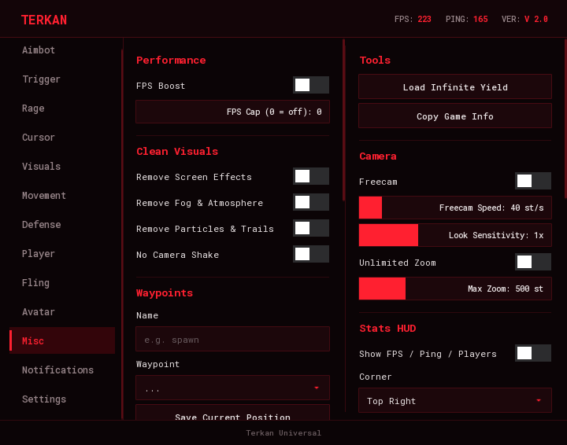
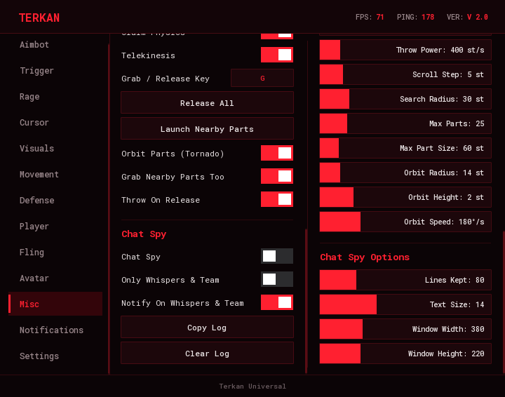

# Terkan Universal

Een universele Roblox-scripthub, gebouwd op **TerkanUI**, een donkerrode UI-bibliotheek. Eén menu met dertien tabs, meer dan 300 instellingen, configs, thema's en sneltoetsen.

<p align="center">
  
</p>

```
Aimbot · Trigger · Rage · Cursor · ESP · Visuals · Movement · Defense · Player · Fling · Avatar · Misc · Notifications · Settings
```

> **Gebruik het in je eigen games en privéservers.** Scripts zoals dit zijn in de meeste openbare games niet toegestaan en kunnen je account laten verbannen. Jij bent zelf verantwoordelijk voor waar je het draait. Zie de [disclaimer](#disclaimer).

---

## Installeren

Je hebt een Roblox-executor nodig met `loadstring`, `readfile`/`writefile` en `getgenv`.

**Loader in één regel**

```lua
local base = "https://raw.githubusercontent.com/tygovansteenpaalwork-gif/Roblox_lua_script/main/"
getgenv().TERKANUI = loadstring(game:HttpGet(base .. "TerkanUI.lua"))()
loadstring(game:HttpGet(base .. "TerkanUniversal.lua"))()
```

**Of vanuit bestanden**

1. Zet `TerkanUI.lua` en `TerkanUniversal.lua` in de workspace-map van je executor.
2. Voer dit uit:

```lua
loadstring(readfile("TerkanUniversal.lua"))()
```

Druk op **RightShift** om het menu te openen en te sluiten (aan te passen onder *Settings → Menu*).

Configs worden opgeslagen in `Terkan/configs/*.json` in de workspace-map.

---

## Functies

### Aimbot
Soft aim met vijf types: *Smooth Camera*, *Hard Lock*, *Snap On Fire*, *Mouse Move* en *Character Face*. Op toets vasthouden of altijd aan, doelonderdeel, prioriteit, gladheid, voorspelling, plakkend doelwit, FOV-cirkel en team-, dode- en muurcontrole. De aimbot pauzeert zodra je muis boven het menu staat.

### Silent
Silent aim met hitkans, FOV-weergave en "target any direction". Dit vereist een executor met `hookmetamethod` en `getnamecallmethod`. Zonder die functies wordt de tab niet aangemaakt.

### Trigger
Triggerbot met teamcontrole, reactietijd, schietvertraging, maximale afstand en een modus met vasthoudtoets of altijd aan. Hij schiet op wat onder je muis staat, ook als het menu open is (zolang je muis niet op het menu zelf staat). De vuurmethode **Auto** klikt precies op de plek van je muis. Met **Include NPCs / Dummies** mikt hij ook op poppen en NPC's, niet alleen op spelers.

Zolang de Trigger aan staat, laat een **statusregel onder je richtkruis** zien wat hij doet: `TRIGGER · naam` als hij iets ziet, en anders waarom hij niet vuurt (muis op het menu, vasthoudtoets niet ingedrukt, niets onder de muis, geen doelwit, verkeerd lichaamsdeel of een teamgenoot).

### Rage
Een complete automatische gevechtsmodule: doelkeuze (iedereen of één gekozen speler), minimale en maximale afstand, FOV-limiet, aim-gladheid, voorspelling die rekening houdt met ping, burst-vuur, schietvertraging met jitter, vuurkegel, ForceField overslaan, positionering (achter, boven, onder, cirkel of heen-en-weer) en een spinbot. De vuurmethode **Auto** stuurt een klik in het spel en valt terug op `Tool:Activate` of `mouse1click`. Optioneel gebruikt hij automatisch je vaardigheden: hij drukt je hotbar-slots en extra toetsen in een rotatie met een eigen cooldown per vaardigheid.

<p align="center">
  
</p>

Rage **pauzeert zolang het menu open is**, zodat je hem altijd kunt uitzetten, en met **End** schakel je hem aan of uit met het toetsenbord.

### Cursor
Een eigen richtkruis (kruis, X, ster, cirkel, stip ...) met regenboogkleuren, rotatie, animaties en een "mikt op"-label met naam, afstand en gezondheid.

### ESP
Speler-ESP met een 3D-box, **skeleton** (lijnen door de gewrichten, voor R6 en R15), een **groene gezondheidsbalk links van de box** die van onder naar boven loopt (optioneel verkleurend naar rood bij weinig gezondheid), namen, afstand, vastgehouden item, chams en tracers, met volledige kleurkeuze. Spelers op je whitelist en blacklist krijgen een eigen kleur. Ook fullbright, tijd van de dag en FOV.

### Visuals
Een shader-look die de game er mooier uit laat zien, zonder kleurfilter over het scherm. Alles wordt bij uitzetten teruggezet.
- **Vivid Colors** – fellere kleuren, meer contrast, gloed op felle plekken en zonnestralen. Looks: Natural, Vivid, Ultra Vivid, Extreme, Hyper en Cinematic (met een lichte scherptediepte), plus een Intensity-slider.
- **Future Lighting** – zet de moderne lichtengine aan (via een verborgen property).
- **Shadows & Reflections** – zonneschaduwen, zachtere schaduwranden en reflecties van de lucht.
- **Max Graphics**, **Rich Light** (een fellere zon), **Clear Air** (geen mist of waas), **Pretty Water** (helder, reflecterend water) en **Extra Stars**.
- **Lock Time** – zet de tijd van de dag vast op een zelfgekozen moment.

### Movement
Snelheid, springen, vliegen (met verticale snelheid en gladheid), noclip, oneindig springen en anti stun (je kunt nog bewegen als het spel je neer wil houden).

Daarnaast beweegt **CFrame Speed** je karakter door zijn CFrame aan te passen in plaats van `WalkSpeed`, zodat een spel dat `WalkSpeed` uitleest niets ongewoons ziet. Je stelt extra snelheid, acceleratietijd en een sprint-vermenigvuldiger in, en kunt het beperken tot een ingedrukte toets of tot de grond. **Stop At Walls** voorkomt dat je door dunne muren schiet. **CFrame Fly** vliegt richting je camera (optioneel met je karakter mee gedraaid) en blijft zonder input precies op zijn plek hangen. De **Dash** verplaatst je in een korte, instelbare tijd over een instelbare afstand, met een eigen cooldown.

<p align="center">
  
</p>

### Defense
- **Anti Fling** – voorkomt dat lichamen van andere spelers tegen je botsen en annuleert plotselinge lanceringen.
- **Anti Void** – zet je terug op de laatste vaste grond als je onder de map valt.
- **Anti Aim** – jitter of spin, zodat niets zich op je kan richten.
- **Anti Ragdoll** – zolang het spel je als geraakt of geragdolld markeert, weiger je de status: je blijft overeind en houdt je snelheid en spronghoogte. Het is gemaakt voor The Strongest Battlegrounds, dat deze status als accessoires op je karakter zet (`Ragdoll`, `RagdollSim` en `Freeze`). Met **Cancel Hit Stun** loop je ook door de korte stun na een klap heen. De server denkt nog steeds dat je geragdolld bent, dus moves die hij zelf controleert kunnen geblokkeerd blijven.
- **Desync** – andere spelers zien je ergens anders dan waar je echt bent: *Stay Here*, *Behind*, *Left*, *Right*, *Above*, *Lag* of *Orbit*. Met de schakelaar **Show Copy** teken je op de plek waar anderen je zien een gewone kopie van je character, zodat je kunt controleren waar je staat. De schuif *Stay Radius* staat op **Infinite** als je hem op het maximum zet.

<p align="center">
  
</p>

### Player
Teleporteren en toekijken, een speler volgen (met een glijdende automatische afstand), om een speler heen draaien (cirkel, deinen of achtje, met lock-on) en een inventaris-inspecteur die laat zien wat een speler vasthoudt en bij zich draagt.

**Animations:** *No Animations* stopt de animaties van je eigen karakter. Andere spelers zien dan ook geen animatie, omdat jouw client zijn animator zelf naar de server stuurt. Je kiest tussen *Stop All*, *Stop Attacks Only* (alleen move-animaties, lopen en idle blijven) en *Freeze Pose*. Tracks worden gestopt op het moment dat ze starten en nog meerdere keren per frame, zodat er niets doorheen glipt. Speelt de server een animatie zelf af, dan kan een client die niet tegenhouden.

**Whitelist en blacklist:** kies spelers uit de server. Whitelist (vrienden) worden door aimbot, silent aim, triggerbot en rage overgeslagen. Blacklist (doelwitten) zijn eerst aan de beurt, en met *Only Target Blacklist* wordt alleen op hen gemikt. Een speler staat op maximaal één lijst. De lijsten werken op naam, blijven kloppen als iemand weggaat en terugkomt, en worden in je config opgeslagen. Met **Auto-Whitelist Roblox Friends** komen je Roblox-vrienden automatisch op de whitelist zodra ze de server binnenkomen.

### Fling
Voor gebruik met je eigen alt of vrienden in een privéserver. Fling werkt via fysiek contact: je karakter blijft tegen het doelwit plakken en draait razendsnel, zodat de fysica hem wegwerpt. De snelheid staat alleen tijdens de fysicastap aan en wordt daarna weer op nul gezet, dus je vliegt zelf niet weg. Daarna word je teruggezet op je beginplek.

- **Fling Selected Player** en **Fling All** – de speler uit de dropdown van de Player-tab, of iedereen. **Loop Fling All** herhaalt dat met een instelbare pauze. Whitelist en teamgenoten (*Skip Teammates*) worden overgeslagen.
- **Void Spam** – blijft spelers onder de map sturen en pakt ze na elke respawn opnieuw. *Targets* is *Selected*, *All*, *Nearest* of *Blacklist Only*. Wie al in de void zit, wordt overgeslagen. Met de schuiven regel je kracht, tijd per speler, hoe diep iemand moet zijn om als void te tellen, de neerwaartse en zijwaartse kracht, en de pauzes tussen doelwitten en rondes.
- **Stop** breekt elke lopende actie af, en de camera kan het doelwit volgen (*Camera Follows Target*).

<p align="center">
  
</p>

### Avatar
Word een kopie van een andere speler: zijn accessoires, kleding, kleuren, gezicht en hoofd. Kies iemand in de server of typ elke Roblox-**gebruikersnaam of UserId**. Met **Restore My Avatar** krijg je je eigen uiterlijk exact terug, en de gekopieerde look blijft behouden na een respawn. Dit werkt alleen aan jouw kant: andere spelers blijven je echte avatar zien.

### Misc
Anti-AFK, FPS-boost, server hoppen, een Infinite Yield-knop en universele hulpmiddelen die in elke game werken:

- **Clean Visuals** – haalt schermeffecten (blur, bloom, kleurcorrectie, sun rays, depth of field), mist en atmosfeer weg, verbergt alle deeltjes en trails (ook die met `Emit()` worden afgevuurd) en zet camerashake uit. Alles wordt bij uitzetten teruggezet, en effecten die het spel zelf weer aanzet worden tegengehouden.
- **Freecam** – de camera maakt zich los van je karakter (WASD, `E`/`Space` omhoog, `Q`/`Ctrl` omlaag, `Shift` sneller, rechtermuisknop om rond te kijken). **Unlimited Zoom** haalt de zoomgrens weg.
- **Waypoints** – sla posities op met een naam en teleporteer erheen. Ze worden per game bewaard als je executor bestanden kan schrijven.
- **Stats HUD** – FPS, ping en aantal spelers in een hoek naar keuze.
- **Telekinesis** – één schakelaar die losse (unanchored) onderdelen naar je toe trekt en in een patroon om je heen laat zweven: **Infinity** (een ∞ die voor je hangt), **Ring**, **Tornado**, **Sphere**, **Galaxy**, **DNA Helix** of **Wings**, of **Cycle** dat elke 8 seconden wisselt. Je regelt maar twee dingen: **Distance** (de minimale afstand tussen jou en de onderdelen) en **Range** (hoe ver hij zoekt, tot 1500 studs en daarna *Infinite*). Met de **Fire Key** (standaard `G`) schiet je alle onderdelen naar je cursor en de knop **Release All** laat ze los. Alleen onderdelen waarvan jij de fysica bezit reageren en worden door anderen gezien; de simulatieradius wordt automatisch vergroot en je krijgt een melding hoeveel onderdelen echt van jou zijn. Zet je het uit, dan krijgen alle onderdelen hun botsing terug en wordt de simulatieradius hersteld. Het werkt alleen op losse onderdelen: vaste onderdelen, spelers en NPC's kun je niet grijpen.
- **Chat Spy** – een sleepbaar venster in de stijl van het menu (de kleuren volgen je thema) dat elk chatbericht toont dat je client ontvangt, gemarkeerd als gewoon, fluister of team. Je kunt de log kopiëren of wissen. Fluisterberichten tussen andere spelers worden bij de nieuwere TextChatService nooit naar jouw client gestuurd, dus die kan geen enkel script zien.

<p align="center">
  
</p>

<p align="center">
  
</p>

### Notifications
Tekstmeldingen boven het richtkruis met je eigen kleur (of thema of regenboog), duur, positie, stapeling en een schakelaar per categorie.

### Settings
- **Configs** – aanmaken, overschrijven, laden, verwijderen, verversen en autoload instellen of wissen.
- **Theme** – meerdere ingebouwde thema's en een vrije accentkleur.
- **Menu** – menutoets, achtergrondvervaging, UI-schaal en het menu uitladen.
- **Binds** – een sneltoets voor elke belangrijke functie (Soft Aim, Silent Aim, Triggerbot, Rage, ESP, Fly, Follow, Orbit, Cursor, Anti Fling, Anti Void, Anti Ragdoll, Anti Aim, Desync, Noclip, Speed, No Animations, Loop Fling All, Void Spam, Freecam, CFrame Speed, CFrame Fly, Telekinesis, Chat Spy en Clean Particles).

---

## Standaardtoetsen

| Actie | Toets |
| --- | --- |
| Menu openen en sluiten | `RightShift` |
| Soft aim (vasthouden) | `MB2` |
| Triggerbot | `LeftAlt` |
| Rage-vasthoudtoets | `V` |
| Rage aan of uit | `End` |
| Vliegen | `F` |
| Telekinesis: onderdelen naar je cursor schieten (Fire Key) | `G` |

Elke toets is aan te passen in het menu. Met `Backspace` wis je een bind en met `Escape` annuleer je.

---

## Bestanden

| Bestand | Wat het is |
| --- | --- |
| `TerkanUI.lua` | De UI-bibliotheek: venster, tabs, secties, schakelaars, schuiven, dropdowns, kleurkiezers, keybinds, configs, thema's en meldingen. |
| `TerkanUniversal.lua` | De hub zelf. Heeft `TerkanUI.lua` nodig. |

---

## Opmerkingen

- Getest met de **Xeno**-executor. Functies die `hookmetamethod` nodig hebben (Silent Aim) zijn alleen beschikbaar waar de executor dat ondersteunt.
- Games verschillen. Sommige negeren `mouse1click` en `Tool:Activate`, andere hebben een echte klik in het spel nodig, en sommige verplaatsen zelf de camera. Daarom is de vuurmethode van Rage en Trigger standaard **Auto** (een klik in het spel, met terugval). Probeer bij problemen de andere methodes en aim-types.
- Met het menu open pauzeert Rage, zodat je hem altijd kunt uitzetten. De zijbalk met tabs scrolt als er meer tabs zijn dan er passen.
- Alles wat op andere spelers werkt (Fling, Void Spam, Telekinesis) is alleen bedoeld voor privéservers en je eigen ervaringen.
- Sommige onderdelen hangen af van je executor. Telekinesis gebruikt `sethiddenproperty`, `gethiddenproperty` en `isnetworkowner` om je simulatieradius te vergroten en te zien welke onderdelen van jou zijn, en Waypoints en Copy Log gebruiken `writefile`, `readfile` en `setclipboard`. Zonder die functies werkt het onderdeel beperkt of niet.
- Eigenschappen van je karakter uitlezen en vervalsen (een *property spoof*) kan alleen met `hookmetamethod`, `getrawmetatable` of `debug.getmetatable`. Op de executor waarmee dit is getest ontbreken die functies, dus dat is niet gebouwd.

---

## Disclaimer

Dit project is bedoeld voor educatie en voor gebruik in games die van jou zijn of waarin je toestemming hebt om te testen. Exploits gebruiken in games die dat verbieden, is in strijd met de Roblox-gebruiksvoorwaarden en met de regels van die games, en kan tot een ban leiden. Er is geen enkele garantie en er wordt niet beweerd dat het script onopgemerkt blijft. Je gebruikt het op eigen risico.
