# Terkan Universal

Een universele Roblox-scripthub, gebouwd op **TerkanUI**, een donkerrode UI-bibliotheek. Eén menu met vijftien tabs, meer dan 300 instellingen, configs, thema's en sneltoetsen.

```
Aimbot · Trigger · Rage · Cursor · ESP · Visuals · Movement · Defense · Player · Fling · Avatar · FE · Misc · Notifications · Settings
```

> **Gebruik het in je eigen games en privéservers.** Scripts zoals dit zijn in de meeste openbare games niet toegestaan en kunnen je account laten verbannen. Jij bent zelf verantwoordelijk voor waar je het draait. Zie de [disclaimer](#disclaimer).

---

## Snel starten

Eén regel laadt de loader, en daarna kies je wat je wilt:

```lua
local Terkan = loadstring(game:HttpGet("https://raw.githubusercontent.com/tygovansteenpaalwork-gif/Roblox_lua_script/main/Terkan.lua"))()

Terkan.hub()              -- het hele menu met alle 15 tabs
Terkan.feature("esp")     -- of maar één functie, in een klein menu van zichzelf
local UI = Terkan.ui()    -- of alleen de UI-bibliotheek, om een eigen menu te bouwen
```

Wil je een eigen menu of hub maken? Begin met [`examples/my_menu.lua`](examples/my_menu.lua) (alleen een menu) of [`examples/my_hub.lua`](examples/my_hub.lua) (eigen tabs en functies met de hulpfuncties van de library), en lees de [handleiding van TerkanUI](docs/UI.md) en de [handleiding voor je eigen hub](docs/HUB.md). Alle namen die `Terkan.feature()` kent staan in [`features/README.md`](features/README.md) of via `Terkan.list()`.

---

## Installeren

Je hebt een Roblox-executor nodig met `loadstring`, `readfile`/`writefile` en `getgenv`.

**Loader in één regel**

```lua
local base = "https://raw.githubusercontent.com/tygovansteenpaalwork-gif/Roblox_lua_script/main/"
getgenv().TERKANUI = loadstring(game:HttpGet(base .. "TerkanUI.lua"))()
loadstring(game:HttpGet(base .. "TerkanUniversal.lua"))()
```

**Of vanuit bestanden**

1. Zet `TerkanUI.lua` en `TerkanUniversal.lua` in de workspace-map van je executor.
2. Voer dit uit:

```lua
loadstring(readfile("TerkanUniversal.lua"))()
```

Druk op **RightShift** om het menu te openen en te sluiten (aan te passen onder *Settings → Menu*).

Configs worden opgeslagen in `Terkan/configs/*.json` in de workspace-map.

---

## Nieuw in 2.4.0

- **Rage kiest je wapen.** Onder *Firing* staat **Weapon**: `Auto` (de eerste tool die geen ability is), `No Tool (fists)` of een tool uit je inventory. Na een ability pakt Rage je wapen terug, en het wapen staat nooit tussen de abilities.
- **Rage loopt niet meer vast.** Extra Keys die al een menu-sneltoets zijn (zoals F = Fly) worden overgeslagen, abilities worden direct in je hand gezet (standaard *Equip + Activate*), en bij *Position* wordt je snelheid elke frame op nul gezet en volg je een target nooit de void in.
- **Give Up If No Damage.** Een target dat een paar seconden geen schade krijgt, slaat Rage 5 seconden over. De status zegt nu ook waarom er geen target is (`no target (behind wall)`, `too far`, `teammate` ...).
- **Rage gaat voor.** Aimbot en Triggerbot pauzeren zolang Rage een target heeft, zodat ze niet tegelijk aan je camera trekken of dubbel schieten.
- **Anti Stun en Anti Ragdoll zijn één routine** en werken nu ook na een respawn. Ze herkennen meer stun-markeringen, zetten een verlaagde loopsnelheid terug, maken vastgezette onderdelen los en zetten tijdens een stun je besturing weer aan.
- **Dubbele sneltoetsen** geven een melding met de functies die dezelfde toets gebruiken.
- **Aimbot** heeft nu ook *Skip ForceField* en *Skip Invisible Rigs*.
- **Click TP** doet niets zolang Fly aan staat (beide gebruiken Ctrl).
- **Noclip, Superman Fly en Fling** delen één lijst met onderdelen in plaats van je karakter elke physics-stap opnieuw te doorzoeken.

## Nieuw in 2.3.0

- **Library.** Eén ingang voor alles: `Terkan.lua` laadt de hub, elk los bestand of alleen de UI-bibliotheek. Zie [Library](#library).
- **Bronmap `src/`.** De hub wordt nu gebouwd uit kleine bestanden per tab (`src/03_rage.lua`, `src/05_esp.lua` ...) in plaats van uit één bestand van 6000 regels. `python tools/build.py` bundelt ze, maakt `features/` en controleert alles.
- **Echte controle.** `tools/check.py` draait de Luau-compiler en -analyzer over de hub, de UI en alle losse bestanden: syntaxfouten, de grens van 200 locals en niet-gedefinieerde namen worden meteen gevonden, nog voor je het in Roblox laadt.
- **ESP ruimt zichzelf op** en telt zijn eigen bouwacties, zodat een lek zichtbaar is en niet kan ophopen.
- **Sneller doelwit kiezen.** Alle features die spelers zoeken delen één lijst per frame (`U.Others()`), de wandcontrole zet zijn raycast-filter niet meer bij elke aanroep opnieuw en slaat onderdelen over die het resultaat niet meer kunnen veranderen.
- **Rage: Skip Invisible Rigs** (zie [Rage](#rage)).
- **Alle 15 tabs opnieuw in beeld**, gemaakt met `tools/screenshot.ps1`.

---

## Library

Het hele project is ook een bibliotheek. Eén regel geeft je de loader:

```lua
local Terkan = loadstring(game:HttpGet("https://raw.githubusercontent.com/tygovansteenpaalwork-gif/Roblox_lua_script/main/Terkan.lua"))()
```

| Aanroep | Wat het doet |
| --- | --- |
| `Terkan.hub()` | Laadt `TerkanUI.lua` en daarna de hele hub. |
| `Terkan.feature("esp")` | Laadt één functie in een klein menu van zichzelf. |
| `Terkan.list()` | Alle beschikbare functienamen, alfabetisch. |
| `Terkan.info("rage")` | `{ name, title, about, file }` van een functie. |
| `Terkan.ui()` | Alleen de UI-bibliotheek, om een eigen menu te bouwen. |
| `Terkan.core({ Name, Title })` | Een venster plus de hulpfuncties van de hub (doelwitten zoeken, instellingen, meldingen ...), om een eigen hub te bouwen. |
| `Terkan.version()` | Het versienummer van de hub op GitHub. |
| `Terkan.setBase(url)` | Wijs de loader naar een fork, een andere branch of een lokale webserver. |

De lijst komt uit `features/manifest.json`, dat `tools/build.py` schrijft, dus hij is altijd gelijk aan wat er echt staat.

**Een eigen menu bouwen** kan met `Terkan.ui()`, en [`docs/UI.md`](docs/UI.md) beschrijft alle opties en bedieningselementen. [`examples/my_menu.lua`](examples/my_menu.lua) is een compleet voorbeeld van een klein venster met een schakelaar, twee schuiven, een knop met melding, een dropdown, een keybind en een kleurkiezer:

```lua
loadstring(game:HttpGet("https://raw.githubusercontent.com/tygovansteenpaalwork-gif/Roblox_lua_script/main/examples/my_menu.lua"))()
```

---

## Functies

### Aimbot
<p align="center">
  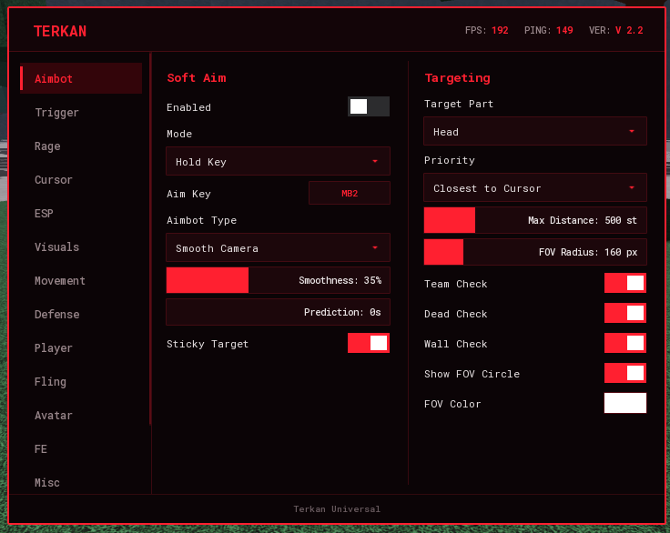
</p>

Soft aim met vijf types: *Smooth Camera*, *Hard Lock*, *Snap On Fire*, *Mouse Move* en *Character Face*. Op toets vasthouden of altijd aan, doelonderdeel, prioriteit, gladheid, voorspelling, plakkend doelwit, FOV-cirkel en team-, dode- en muurcontrole. De aimbot pauzeert zodra je muis boven het menu staat.

### Silent
Silent aim met hitkans, FOV-weergave en "target any direction". Dit vereist een executor met `hookmetamethod` en `getnamecallmethod`. Zonder die functies wordt de tab niet aangemaakt.

### Trigger
<p align="center">
  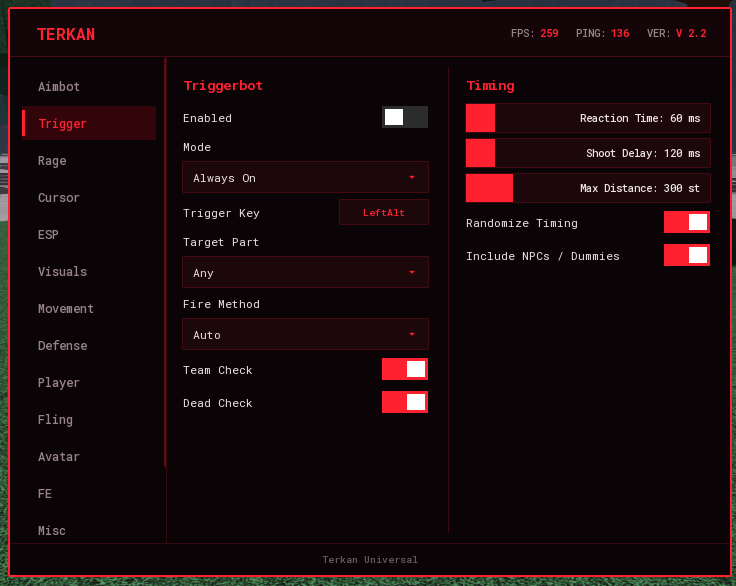
</p>

Triggerbot met teamcontrole, reactietijd, schietvertraging, maximale afstand en een modus met vasthoudtoets of altijd aan. Hij schiet op wat onder je muis staat, ook als het menu open is (zolang je muis niet op het menu zelf staat). De vuurmethode **Auto** klikt precies op de plek van je muis. Met **Include NPCs / Dummies** mikt hij ook op poppen en NPC's, niet alleen op spelers.

Zolang de Trigger aan staat, laat een **statusregel onder je richtkruis** zien wat hij doet: `TRIGGER · naam` als hij iets ziet, en anders waarom hij niet vuurt (muis op het menu, vasthoudtoets niet ingedrukt, niets onder de muis, geen doelwit, verkeerd lichaamsdeel of een teamgenoot).

### Rage
<p align="center">
  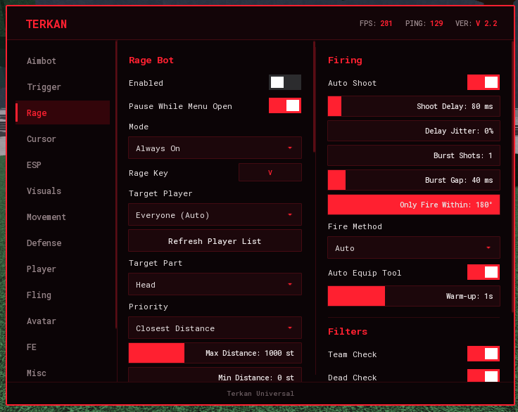
</p>

Een complete automatische gevechtsmodule: doelkeuze (iedereen of één gekozen speler), minimale en maximale afstand, FOV-limiet, aim-gladheid, voorspelling die rekening houdt met ping, burst-vuur, schietvertraging met jitter, vuurkegel, ForceField overslaan, positionering (achter, boven, onder, cirkel of heen-en-weer) en een spinbot. De vuurmethode **Auto** stuurt een klik in het spel en valt terug op `Tool:Activate` of `mouse1click`. Optioneel gebruikt hij automatisch je vaardigheden: hij drukt je hotbar-slots en extra toetsen in een rotatie met een eigen cooldown per vaardigheid.

Onder **Filters** slaat *Skip Invisible Rigs* (standaard aan) spelers over waarvan het karakter volledig doorzichtig is: lobby-, toeschouwer- of verborgen rigs waar je niets aan kunt raken. Zonder dit teleporteerde Rage soms naar zo'n rig. Aimbot heeft dezelfde optie; Trigger en ESP blijven zulke spelers wel gewoon zien, want een speler die tijdelijk onzichtbaar is door een vaardigheid wil je meestal juist wel kunnen zien.

Rage **pauzeert zolang het menu open is**, zodat je hem altijd kunt uitzetten, en met **End** schakel je hem aan of uit met het toetsenbord.

### Cursor
<p align="center">
  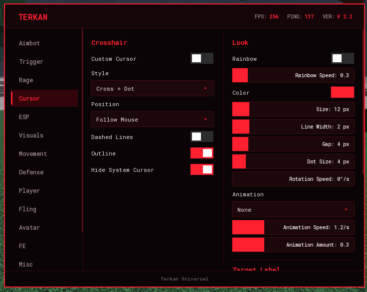
</p>

Een eigen richtkruis (kruis, X, ster, cirkel, stip ...) met regenboogkleuren, rotatie, animaties en een "mikt op"-label met naam, afstand en gezondheid.

### ESP
<p align="center">
  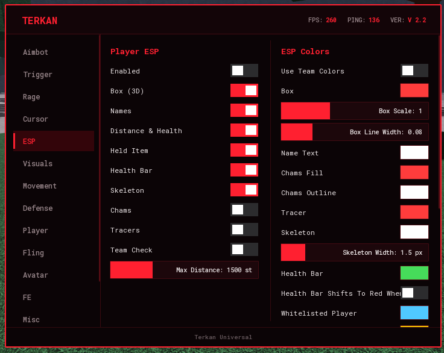
</p>

Speler-ESP met een 3D-box, **skeleton** (lijnen door de gewrichten, voor R6 en R15), een **groene gezondheidsbalk links van de box** die van onder naar boven loopt (optioneel verkleurend naar rood bij weinig gezondheid), namen, afstand, vastgehouden item, chams en tracers, met volledige kleurkeuze. Spelers op je whitelist en blacklist krijgen een eigen kleur. Ook fullbright, tijd van de dag en FOV.

De ESP **ruimt zichzelf op**: elke seconde verwijdert hij alles wat bij geen levende speler hoort (sets van spelers die weg zijn, kapotgemaakte onderdelen, losse resten), zodat er in een drukke server niets kan ophopen. `U.EspStats()` laat zien hoeveel sets er zijn, hoe vaak er is gebouwd en waarom (zie [Ontwikkelen](#ontwikkelen)).

### Visuals
<p align="center">
  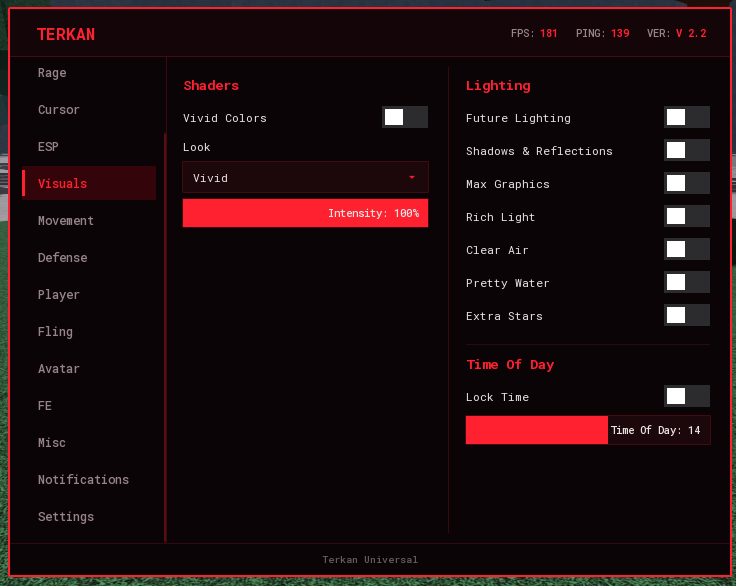
</p>

Een shader-look die de game er mooier uit laat zien, zonder kleurfilter over het scherm. Alles wordt bij uitzetten teruggezet.
- **Vivid Colors** – fellere kleuren, meer contrast, gloed op felle plekken en zonnestralen. Looks: Natural, Vivid, Ultra Vivid, Extreme, Hyper en Cinematic (met een lichte scherptediepte), plus een Intensity-slider.
- **Future Lighting** – zet de moderne lichtengine aan (via een verborgen property).
- **Shadows & Reflections** – zonneschaduwen, zachtere schaduwranden en reflecties van de lucht.
- **Max Graphics**, **Rich Light** (een fellere zon), **Clear Air** (geen mist of waas), **Pretty Water** (helder, reflecterend water) en **Extra Stars**.
- **Lock Time** – zet de tijd van de dag vast op een zelfgekozen moment.

### Movement
<p align="center">
  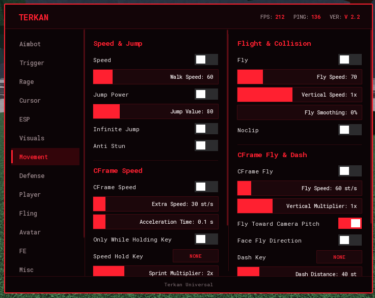
</p>

Snelheid, springen, vliegen (met verticale snelheid en gladheid), noclip, oneindig springen en anti stun (je kunt nog bewegen als het spel je neer wil houden).

Daarnaast beweegt **CFrame Speed** je karakter door zijn CFrame aan te passen in plaats van `WalkSpeed`, zodat een spel dat `WalkSpeed` uitleest niets ongewoons ziet. Je stelt extra snelheid, acceleratietijd en een sprint-vermenigvuldiger in, en kunt het beperken tot een ingedrukte toets of tot de grond. **Stop At Walls** voorkomt dat je door dunne muren schiet. **CFrame Fly** vliegt richting je camera (optioneel met je karakter mee gedraaid) en blijft zonder input precies op zijn plek hangen. De **Dash** verplaatst je in een korte, instelbare tijd over een instelbare afstand, met een eigen cooldown.

### Defense
<p align="center">
  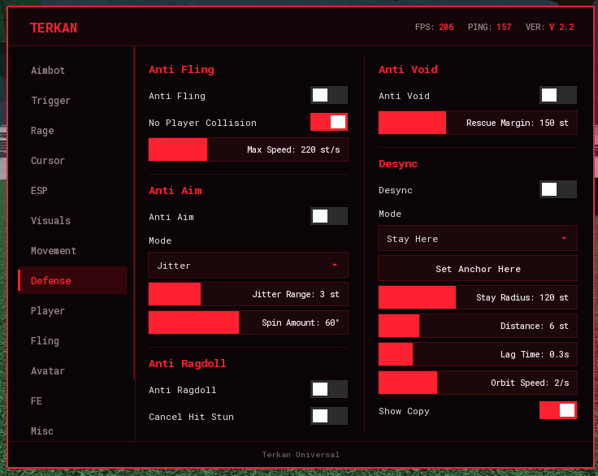
</p>

- **Anti Fling** – voorkomt dat lichamen van andere spelers tegen je botsen en annuleert plotselinge lanceringen.
- **Anti Void** – zet je terug op de laatste vaste grond als je onder de map valt.
- **Anti Aim** – jitter of spin, zodat niets zich op je kan richten.
- **Anti Ragdoll** – zolang het spel je als geraakt of geragdolld markeert, weiger je de status: je blijft overeind en houdt je snelheid en spronghoogte. Het is gemaakt voor The Strongest Battlegrounds, dat deze status als accessoires op je karakter zet (`Ragdoll`, `RagdollSim` en `Freeze`). Met **Cancel Hit Stun** loop je ook door de korte stun na een klap heen. De server denkt nog steeds dat je geragdolld bent, dus moves die hij zelf controleert kunnen geblokkeerd blijven.
- **Desync** – andere spelers zien je ergens anders dan waar je echt bent: *Stay Here*, *Behind*, *Left*, *Right*, *Above*, *Lag* of *Orbit*. Met de schakelaar **Show Copy** teken je op de plek waar anderen je zien een gewone kopie van je character, zodat je kunt controleren waar je staat. De schuif *Stay Radius* staat op **Infinite** als je hem op het maximum zet.

### Player
<p align="center">
  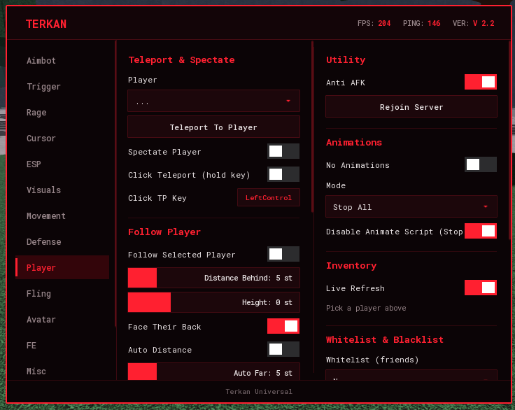
</p>

Teleporteren en toekijken, een speler volgen (met een glijdende automatische afstand), om een speler heen draaien (cirkel, deinen of achtje, met lock-on) en een inventaris-inspecteur die laat zien wat een speler vasthoudt en bij zich draagt.

**Animations:** *No Animations* stopt de animaties van je eigen karakter. Andere spelers zien dan ook geen animatie, omdat jouw client zijn animator zelf naar de server stuurt. Je kiest tussen *Stop All*, *Stop Attacks Only* (alleen move-animaties, lopen en idle blijven) en *Freeze Pose*. Tracks worden gestopt op het moment dat ze starten en nog meerdere keren per frame, zodat er niets doorheen glipt. Speelt de server een animatie zelf af, dan kan een client die niet tegenhouden.

**Whitelist en blacklist:** kies spelers uit de server. Whitelist (vrienden) worden door aimbot, silent aim, triggerbot en rage overgeslagen. Blacklist (doelwitten) zijn eerst aan de beurt, en met *Only Target Blacklist* wordt alleen op hen gemikt. Een speler staat op maximaal één lijst. De lijsten werken op naam, blijven kloppen als iemand weggaat en terugkomt, en worden in je config opgeslagen. Met **Auto-Whitelist Roblox Friends** komen je Roblox-vrienden automatisch op de whitelist zodra ze de server binnenkomen.

### Fling
<p align="center">
  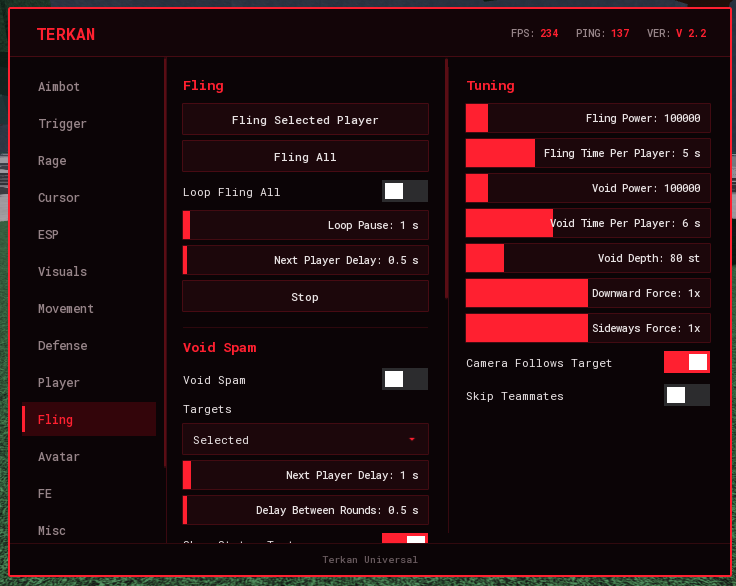
</p>

Voor gebruik met je eigen alt of vrienden in een privéserver. Fling werkt via fysiek contact: je karakter blijft tegen het doelwit plakken en draait razendsnel, zodat de fysica hem wegwerpt. De snelheid staat alleen tijdens de fysicastap aan en wordt daarna weer op nul gezet, dus je vliegt zelf niet weg. Daarna word je teruggezet op je beginplek.

- **Fling Selected Player** en **Fling All** – de speler uit de dropdown van de Player-tab, of iedereen. **Loop Fling All** herhaalt dat met een instelbare pauze. Whitelist en teamgenoten (*Skip Teammates*) worden overgeslagen.
- **Void Spam** – blijft spelers onder de map sturen en pakt ze na elke respawn opnieuw. *Targets* is *Selected*, *All*, *Nearest* of *Blacklist Only*. Wie al in de void zit, wordt overgeslagen. Met de schuiven regel je kracht, tijd per speler, hoe diep iemand moet zijn om als void te tellen, de neerwaartse en zijwaartse kracht, en de pauzes tussen doelwitten en rondes.
- **Next Player Delay** – hoe lang hij na elke speler wacht voordat hij de volgende pakt (0 tot 30 seconden), bij Void Spam en Fling All. Tijdens die pauze staat boven je richtkruis `VOID LOADING... 2.3s`, daarna `VOID ACTIVE`. Met *Show Status Text* zet je die tekst uit.
- **Punch Fling** – een echte punch-animatie plus één korte fling per klap, met een toets of met de linkermuisknop. Op het moment dat je vuist landt, spring je een fractie van een seconde in de speler voor je (binnen *Reach*, en alleen als je naar hem kijkt), geef je hem de fling-snelheidspiek en sta je meteen weer op je plek. Geen spin en geen lang teleporteren. Bij *Animation* kies je Roblox' eigen tool-animaties, de vier M1-slagen en de Normal Punch-move van The Strongest Battlegrounds (daar is dat de standaard), of je zoekt de animaties van het spel zelf met *Scan Game Animations*. *Push Power* regelt de kracht.
- **Stop** breekt elke lopende actie af, en de camera kan het doelwit volgen (*Camera Follows Target*).

### Avatar
<p align="center">
  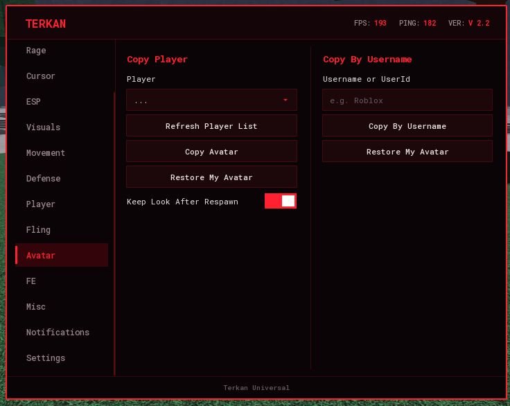
</p>

Word een kopie van een andere speler: zijn accessoires, kleding, kleuren, gezicht en hoofd. Kies iemand in de server of typ elke Roblox-**gebruikersnaam of UserId**. Met **Restore My Avatar** krijg je je eigen uiterlijk exact terug, en de gekopieerde look blijft behouden na een respawn. Dit werkt alleen aan jouw kant: andere spelers blijven je echte avatar zien.

### FE
<p align="center">
  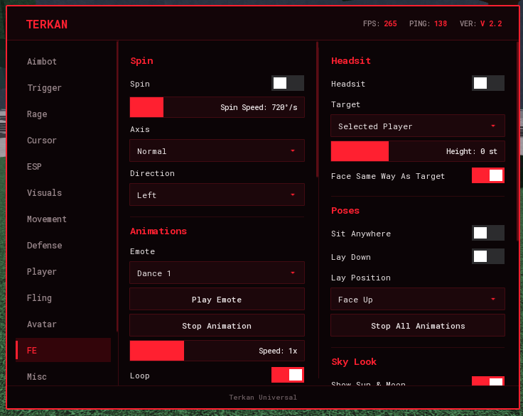
</p>

Alles hier beweegt of animeert **je eigen karakter**, en dat stuurt Roblox naar de server. **Andere spelers zien het dus ook** (alleen de skybox is puur voor jouw scherm). Voor privéservers en eigen games.

- **Spin** – draai razendsnel rond, met instelbare snelheid, richting en as (normaal, salto of zijwaarts).
- **Headsit** – je zit met de echte zitanimatie op het hoofd van een speler (de gekozen speler of de dichtstbijzijnde) en blijft daar zitten, ook als hij rent.
- **Animations** – standaard Roblox-emotes (Dance 1 t/m 3, Wave, Point, Cheer, Laugh, Sit) met snelheid, herhalen, *Freeze Frame* en een eigen toets, of een eigen **animatie-ID**. Alleen animaties van Roblox of van het spel zelf kunnen andere spelers zien.
- **Poses** – *Sit Anywhere*, *Lay Down* (op je rug of buik) en *Stop All Animations*.
- **Superman Fly** – je vliegt waar je camera kijkt, met je lichaam horizontaal en beide armen naar voren (de standaard Cheer-animatie, bevroren op het juiste moment). Sta je stil, dan zweef je rechtop met een Levitation-animatie (R15). Met *Pass Through Walls* ga je door muren.
- **Custom Skybox** – een zelf getekende lucht (Sunset, Neon Night, Aurora, Blood Moon, Deep Space, Pastel Dawn of Ocean Blue, gemaakt als PNG's met kleurverloop en sterren) of je eigen **afbeelding** via een Roblox image-ID, een link of een bestand in je executor-map. Met *Rotate Sky* draait de lucht langzaam.
- **Telekinesis** – één schakelaar die losse (unanchored) onderdelen naar je toe trekt en in een patroon om je heen laat zweven: **Infinity** (een ∞ die voor je hangt), **Ring**, **Tornado**, **Sphere**, **Galaxy**, **DNA Helix** of **Wings**, of **Cycle** dat elke 8 seconden wisselt. Je regelt maar twee dingen: **Distance** (de minimale afstand tussen jou en de onderdelen) en **Range** (hoe ver hij zoekt, tot 1500 studs en daarna *Infinite*). Met de **Fire Key** (standaard `G`) schiet je alle onderdelen naar je cursor en de knop **Release All** laat ze los. Alleen onderdelen waarvan jij de fysica bezit reageren en worden door anderen gezien; de simulatieradius wordt automatisch vergroot en je krijgt een melding hoeveel onderdelen echt van jou zijn. Zet je het uit, dan krijgen alle onderdelen hun botsing terug en wordt de simulatieradius hersteld. Het werkt alleen op losse onderdelen: vaste onderdelen, spelers en NPC's kun je niet grijpen.

### Misc
<p align="center">
  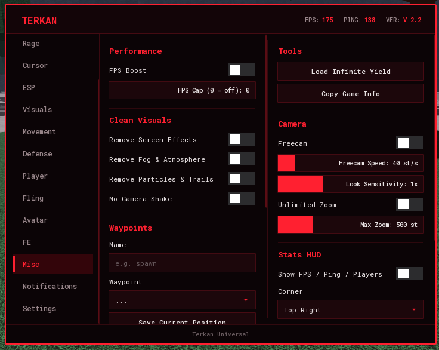
</p>

Anti-AFK, FPS-boost, opnieuw joinen, een Infinite Yield-knop en universele hulpmiddelen die in elke game werken:

- **Clean Visuals** – haalt schermeffecten (blur, bloom, kleurcorrectie, sun rays, depth of field), mist en atmosfeer weg, verbergt alle deeltjes en trails (ook die met `Emit()` worden afgevuurd) en zet camerashake uit. Alles wordt bij uitzetten teruggezet, en effecten die het spel zelf weer aanzet worden tegengehouden.
- **Freecam** – de camera maakt zich los van je karakter (WASD, `E`/`Space` omhoog, `Q`/`Ctrl` omlaag, `Shift` sneller, rechtermuisknop om rond te kijken). **Unlimited Zoom** haalt de zoomgrens weg.
- **Waypoints** – sla posities op met een naam en teleporteer erheen. Ze worden per game bewaard als je executor bestanden kan schrijven.
- **Stats HUD** – FPS, ping en aantal spelers in een hoek naar keuze.
- **Chat Spy** – een sleepbaar venster in de stijl van het menu (de kleuren volgen je thema) dat elk chatbericht toont dat je client ontvangt, gemarkeerd als gewoon, fluister of team. Je kunt de log kopiëren of wissen. Fluisterberichten tussen andere spelers worden bij de nieuwere TextChatService nooit naar jouw client gestuurd, dus die kan geen enkel script zien.

### Notifications
<p align="center">
  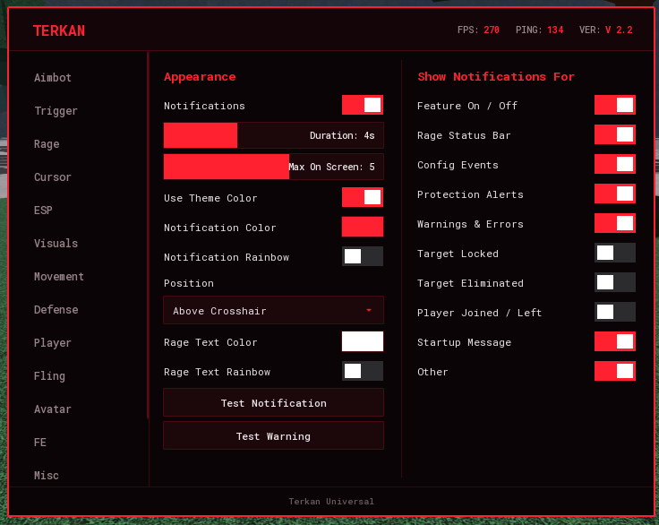
</p>

Tekstmeldingen boven het richtkruis met je eigen kleur (of thema of regenboog), duur, positie, stapeling en een schakelaar per categorie.

### Settings
<p align="center">
  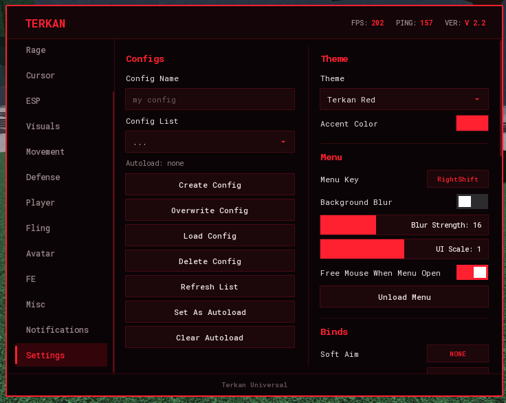
</p>

- **Configs** – aanmaken, overschrijven, laden, verwijderen, verversen en autoload instellen of wissen.
- **Theme** – meerdere ingebouwde thema's en een vrije accentkleur.
- **Menu** – menutoets, achtergrondvervaging, UI-schaal en het menu uitladen.
- **Binds** – een sneltoets voor elke belangrijke functie (Soft Aim, Silent Aim, Triggerbot, Rage, ESP, Fly, Follow, Orbit, Cursor, Anti Fling, Anti Void, Anti Ragdoll, Anti Aim, Desync, Noclip, Speed, No Animations, Loop Fling All, Void Spam, Freecam, CFrame Speed, CFrame Fly, Telekinesis, Spin, Headsit, Superman Fly, Punch Fling, Chat Spy en Clean Particles).

---

## Standaardtoetsen

| Actie | Toets |
| --- | --- |
| Menu openen en sluiten | `RightShift` |
| Soft aim (vasthouden) | `MB2` |
| Triggerbot | `LeftAlt` |
| Rage-vasthoudtoets | `V` |
| Rage aan of uit | `End` |
| Vliegen | `F` |
| Telekinesis: onderdelen naar je cursor schieten (Fire Key) | `G` |

Elke toets is aan te passen in het menu. Met `Backspace` wis je een bind en met `Escape` annuleer je.

---

## Losse functies (`features/`)

Elke functie staat ook als **bestand op eigen naam** in [`features/`](features/README.md), zodat je gewoon kunt zoeken op bijvoorbeeld `desync`, `fly`, `superman_fly`, `custom_skybox`, `punch_fling` of `telekinesis`. Elk bestand draait **op zichzelf**: het opent een klein menu met alleen die functie.

```lua
loadstring(game:HttpGet("https://raw.githubusercontent.com/tygovansteenpaalwork-gif/Roblox_lua_script/main/features/desync.lua"))()
```

Het is dezelfde code als in de hub. `tools/build_features.py` knipt hem eruit, dus de bestanden veranderen mee met elke update van de hub. `features/_core.lua` bevat de gedeelde hulpfuncties en `features/manifest.json` is de index voor `Terkan.lua`. Functies die bij elkaar horen staan samen in één bestand (Void Spam zit in `fling.lua`, Anti Aim in `desync.lua`, CFrame Fly en Dash in `cframe_speed.lua`); die hebben ook een klein bestand op eigen naam dat ernaar verwijst. **Pas deze bestanden niet met de hand aan**: ze worden bij elke build overschreven.

---

## Bestanden

| Bestand | Wat het is |
| --- | --- |
| `Terkan.lua` | De loader van de library ([Library](#library)). |
| `TerkanUI.lua` | De UI-bibliotheek: venster, tabs, secties, schakelaars, schuiven, dropdowns, kleurkiezers, keybinds, configs, thema's en meldingen. |
| `TerkanUniversal.lua` | De hub zelf, **gegenereerd** uit `src/`. Heeft `TerkanUI.lua` nodig. |
| `src/` | De bron van de hub: één bestand per tab, in volgorde van de bestandsnaam. Hier pas je dingen aan. |
| `features/` | Elke functie als eigen, los draaiend bestand (gegenereerd), met `README.md` en `manifest.json`. |
| `tools/` | `build.py` (alles bouwen), `build_features.py`, `check.py` (compiler-controle) en `screenshot.ps1`. |
| `docs/HUB.md` | Handleiding voor een eigen hub: `Terkan.core()`, alle hulpfuncties en een eigen tab in de Terkan-hub. |
| `docs/UI.md` | Handleiding van TerkanUI: venster, tabs, alle bedieningselementen, vlaggen, configs en meldingen. |
| `examples/` | Voorbeelden van het gebruik van de library (`my_menu.lua`, `my_hub.lua`). |
| `assets/tabs/` | De 15 schermafbeeldingen van het menu. |
| `LICENSE` | De MIT-licentie. |
| `version.txt` | Het versienummer waarmee het menu controleert of er een update is. |

---

## Ontwikkelen

### Hoe het in elkaar zit

```
src/00_core.lua ... src/15_settings.lua      de bron: helpers en gedeelde staat, daarna één bestand per tab
        |  tools/build.py  (samenvoegen in bestandsvolgorde)
        v
TerkanUniversal.lua                          de hub die mensen laden
        |  tools/build_features.py
        v
features/*.lua, features/_core.lua,          elke functie los, plus de index voor Terkan.lua
features/README.md, features/manifest.json
        |  tools/check.py
        v
Luau-compile + analyze van alles
```

`src/00_core.lua` bevat de configuratietabel `C`, de helpers (`toggle`, `slider`, `dropdown`, `keybind`, `notify`, `connect`, `onUnload`, `renderLast`), het doelwit kiezen (`charOf`, `selectTarget`) en de levenscyclus (`U.Unload`). Elk ander bestand is één tab.

### Een wijziging maken

```bash
# 1. pas een bestand in src/ aan
# 2. bouw en controleer alles
python tools/build.py                 # bundelen, features/ en manifest maken, compiler-check
python tools/build.py --bump 2.3.1    # idem, en zet het versienummer (version.txt en U.Version)
# 3. commit src/, TerkanUniversal.lua en features/
```

### De controle

De Luau-tools staan niet in de repository. Download `luau-windows.zip` van <https://github.com/luau-lang/luau/releases>, pak hem uit in `tools/bin/` (staat in `.gitignore`) en `python tools/check.py` doet de rest. Het rapport is één regel per bestand: `ok`, `COMPILE ERROR: ...` of `unknown global: ...`.

Twee dingen die de compiler niet kan weten:

- **Wat de executor doet.** `python tools/check.py --wrapper pad/check.lua` schrijft een bestand dat de hub in een lange string zet, met `loadstring` compileert en het resultaat in `getgenv().__TU_ERR` zet. Voer het uit in de executor en lees dan `getgenv().__TU_ERR`: `"OK"` of de foutmelding. Een gewone `execute` van een script met een compilefout lijkt namelijk te slagen, omdat de **oude** versie gewoon blijft draaien.
- **De grens van 200 locals.** Lua staat maximaal 200 locals per functie toe en de hoofdchunk zit daar dicht tegenaan. Nieuwe grote blokken horen in een `;(function() ... end)()` en nieuwe hulpfuncties op `U` (zoals `U.isInvisible` en `U.Others`), niet als extra `local` bovenaan. `tools/check.py` meldt het meteen als het misgaat.

### Handig bij het debuggen

Vanuit de executor, met het menu geladen:

```lua
local U = getgenv().__TerkanUniversal
U.EspStats()              -- { sets, folder, layer, builds, swept, log }: hoeveel ESP-sets, hoe vaak gebouwd en waarom
U.Others()                -- de gedeelde lijst van andere spelers voor deze frame: { plr, char, hum, root }
U.C                       -- de configuratietabel met alle vlaggen
U.Win:SelectTab("Rage")   -- schakel het menu naar een tab
U.Seen                    -- fouten die een feature heeft gemeld (elke fout maar één keer)
```

### Schermafbeeldingen maken

`tools/screenshot.ps1` legt het menu vast (Windows). Schakel eerst van tab met `U.Win:SelectTab(...)` en roep dan het script aan; zie de kop van het bestand. Zo zijn alle bestanden in `assets/tabs/` gemaakt.

---

## Opmerkingen

- Getest met de **Xeno**- en **Solara**-executor. Functies die `hookmetamethod` nodig hebben (Silent Aim) zijn alleen beschikbaar waar de executor dat ondersteunt.
- Games verschillen. Sommige negeren `mouse1click` en `Tool:Activate`, andere hebben een echte klik in het spel nodig, en sommige verplaatsen zelf de camera. Daarom is de vuurmethode van Rage en Trigger standaard **Auto** (een klik in het spel, met terugval). Probeer bij problemen de andere methodes en aim-types.
- Met het menu open pauzeert Rage, zodat je hem altijd kunt uitzetten. De zijbalk met tabs scrolt als er meer tabs zijn dan er passen.
- Alles wat op andere spelers werkt (Fling, Void Spam, Punch Fling, Headsit, Telekinesis) is alleen bedoeld voor privéservers en je eigen ervaringen.
- Sommige onderdelen hangen af van je executor. Telekinesis gebruikt `sethiddenproperty`, `gethiddenproperty` en `isnetworkowner` om je simulatieradius te vergroten en te zien welke onderdelen van jou zijn, en Waypoints en Copy Log gebruiken `writefile`, `readfile` en `setclipboard`. Zonder die functies werkt het onderdeel beperkt of niet.
- Eigenschappen van je karakter uitlezen en vervalsen (een *property spoof*) kan alleen met `hookmetamethod`, `getrawmetatable` of `debug.getmetatable`. Op de executor waarmee dit is getest ontbreken die functies, dus dat is niet gebouwd.

---

## Licentie

Dit project valt onder de [MIT-licentie](LICENSE): iedereen mag de code gebruiken, kopiëren, aanpassen en delen, ook in eigen projecten, zolang de licentietekst en de vermelding van de maker erbij blijven. Er zit geen enkele garantie op.

## Disclaimer

Dit project is bedoeld voor educatie en voor gebruik in games die van jou zijn of waarin je toestemming hebt om te testen. Exploits gebruiken in games die dat verbieden, is in strijd met de Roblox-gebruiksvoorwaarden en met de regels van die games, en kan tot een ban leiden. Er is geen enkele garantie en er wordt niet beweerd dat het script onopgemerkt blijft. Je gebruikt het op eigen risico.
